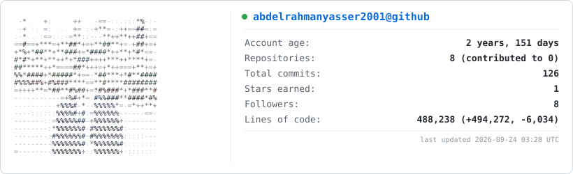

# Hi there, I'm Abdelrahman Yasser! 👋

  
  

---

## 🚀 About Me

I am a recent **Information Systems** graduate with hands-on experience building end-to-end data pipelines, designing databases, and developing full-stack enterprise web applications[cite: 5]. 

Currently, I'm leveraging my skills in **Python, SQL, dbt, and Apache Airflow** to build scalable data analytics workflows, with a strong focus on cloud environments and modern data infrastructures[cite: 5].

* 🎓 **Education:** Bachelor's Degree in Information Systems, AASTMT (GPA: 3.3 / Very Good)[cite: 5]
* 💼 **Recent Role:** Oracle Developer @ Egyptian Armed Forces (Military Service)[cite: 5]
* 📍 **Location:** Egypt (On-site / Remote)[cite: 5]

---

## 🛠️ My Tech Stack

| Category | Technologies |
| :--- | :--- |
| **Data Engineering** |       |
| **Cloud & Storage** |     |
| **Databases** |    |
| **Visualization** |    |
| **Tools & OS** |   |

---

## 📈 My GitHub Stats

Below are my real-time GitHub account statistics, updated automatically twice a day!

  <picture>
    <source media="(prefers-color-scheme: dark)" srcset="dark_mode.svg">
    <source media="(prefers-color-scheme: light)" srcset="light_mode.svg">
    
  </picture>

---

## 📂 Highlighted Projects

| Project | Tech Stack | Key Contributions |
| :--- | :--- | :--- |
| **[Chicago Crime Data Pipeline](https://github.com/abdelrahmanyasser2001/Chicago-Crime-Data-Pipeline)**[cite: 5] | Airflow, Snowflake, dbt, Metabase, Docker[cite: 5] | • Designed and implemented an end-to-end data pipeline to extract raw records[cite: 5]. • Transformed raw datasets using dbt models for analytics[cite: 5]. • Designed custom Metabase dashboards to visualize spatial and temporal crime trends[cite: 5]. |
| **[NCEI to Snowflake DAG](https://github.com/abdelrahmanyasser2001/Airflow-DAG-for-NCEI-to-Snowflake-Data-Pipeline)**[cite: 5] | Apache Airflow, Snowflake, Astronomer[cite: 5] | • Built a robust Airflow DAG extracting historical temperature records from the NCEI API[cite: 5]. • Configured and optimized target schemas, roles, and warehouse compute permissions[cite: 5]. |
| **[University Management System](https://github.com/abdelrahmanyasser2001/University-Management-System)**[cite: 5] | Oracle SQL & PL/SQL[cite: 5] | • Developed procedures, triggers, and sequences for automated enrollment and GPA calculations[cite: 5]. • Designed optimized index architectures to guarantee transactional performance[cite: 5]. |
| **[BashScript DBMS CLI Tool](https://github.com/abdelrahmanyasser2001/BashScript-DBMS-CLI-Tool)**[cite: 5] | Bash Shell Scripting[cite: 5] | • Built a lightweight, menu-driven local DBMS engine entirely from scratch[cite: 5]. • Implemented robust file-based CRUD routines and input sanitization directly in terminal[cite: 5]. |

---

## 🎖️ Certifications

* **Microsoft Certified:** Azure Data Fundamentals (July 2024)[cite: 5]
* **IBM:** Data Warehouse Engineer Professional Certificate (March 2024)[cite: 5]
* **Great Learning:** Big Data Analytics (February 2025)[cite: 5]
